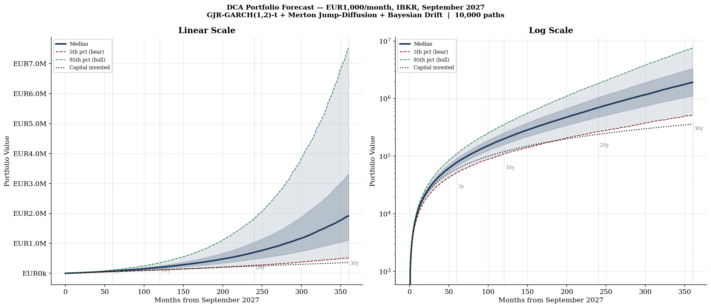

# VWCE Forecasting, Portfolio Analysis & Automated DCA


A self-directed quantitative project around long-horizon, low-cost ETF investing. It has
two parts: a **research/forecasting study** of a global-equity buy-and-hold portfolio,
and a set of **automated execution scripts** that run a monthly DCA plan and a separate
buy-and-hold sleeve through Interactive Brokers.

> Built for my own investing, then written up properly. The research half models what a
> decades-long hold of a world-equity ETF (VWCE / FTSE All-World) could look like under
> realistic return dynamics; the execution half automates the boring, error-prone part —
> placing the trades — with safety rails so real money runs unattended.



## Part 1 — Research & forecasting

- **Return model:** per-asset GJR-GARCH(1,1) with Student-t innovations for volatility
  (leverage effect), Merton jump-diffusion for fat tails, and **Bayesian drift shrinkage**
  pulling each asset's sample mean toward a market prior — because long-horizon terminal
  wealth is dominated by the drift estimate, and raw sample means are noisy.
- **Simulation:** Monte Carlo of terminal wealth over 5/10/20/30-year horizons, producing
  fan charts, terminal-wealth distributions, and XIRR distributions for a monthly-DCA plan.
- **Diagnostics:** EDA, ACF/PACF, GARCH and jump diagnostics, drawdown analysis, monthly
  seasonality, correlation and efficient-frontier comparisons across a broad ETF/stock
  universe.
- **Write-up:** [`VWCE_Full_Report.pdf`](VWCE_Full_Report.pdf) collects the methodology,
  figures, and results.

Run the full analysis:

```bash
pip install numpy pandas arch matplotlib scipy
python refresh_data.py     # pull latest prices (Yahoo Finance; no API key needed)
python run_analysis.py     # Monte Carlo + portfolio comparisons -> figures + mc_results.csv
```

## Part 2 — Automated execution (Interactive Brokers)

Two independent, production-minded traders built on `ib_insync`:

- **`ibkr_dca_auto.py`** — monthly dollar-cost-averaging into a fixed EUR ETF split
  (S&P 500 / Nasdaq-100 / gold / quality / momentum), idempotent per month.
- **`ibkr_buyhold_portfolio.py`** — a two-tranche 60/25/15 buy-and-hold sleeve with an
  annual rebalance, kept strictly separate from the DCA positions in the same account.

**Design principles (real money on autopilot):** idempotent per event, never trades on
margin, only acts when the exchange is genuinely open (parses IBKR trading hours), sanity-
checks every price against the last observation, full logging and desktop notifications.
Run with `--dry-run` to compute and print orders without placing anything.

### Configuration

The scripts read your IBKR account id from an environment variable — **no account
identifiers are committed to this repo**:

```bash
export IBKR_ACCOUNT_ID="U1234567"   # your own IBKR account
```

Connection defaults to `127.0.0.1:7496` (live TWS/Gateway); use port `7497` or set
`PAPER_TRADE = True` for paper trading. See [`BUYHOLD_PORTFOLIO_README.md`](BUYHOLD_PORTFOLIO_README.md)
for the buy-and-hold sleeve's operating guide.

> **Disclaimer:** the execution scripts place live orders when configured to. They are
> provided as-is, for reference; run them against a paper account first and use at your
> own risk. Nothing here is investment advice.

## Data

Prices are pulled from **Yahoo Finance** (free, no key). Included CSVs (`universe_prices.csv`,
`EURUSD_daily.csv`, `VWCE_DE_daily_prices.csv`, spliced history) are public market data used
to make the analysis reproducible.

## License

Released under the [MIT License](LICENSE).
